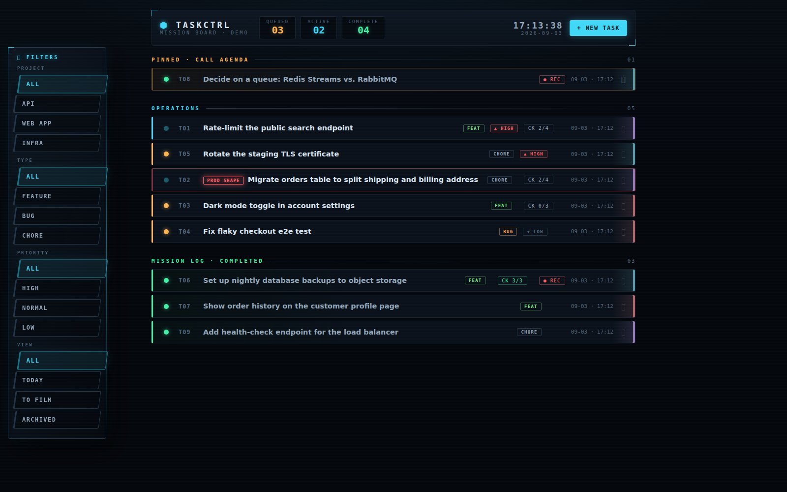
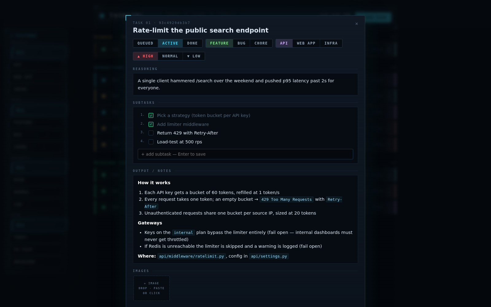
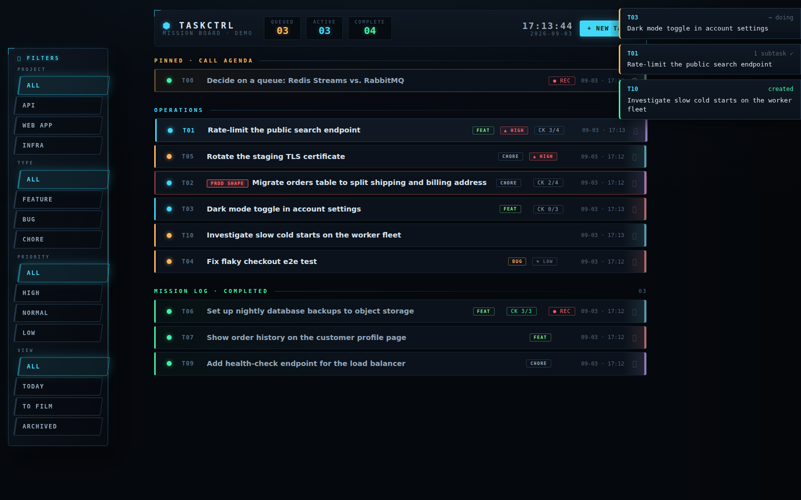

# ⬢ TASKCTRL

A single-file, zero-dependency task board with a sci-fi mission-console UI — built to be
maintained by AI agents as much as by you.

One Python file. Python stdlib only. One JSON file as the database. No build step, no
npm, no docker, nothing to configure.

```bash
python3 server.py
# → http://localhost:8100
```



## Why it exists

Most task tools assume a human clicking a UI. TASKCTRL assumes your tasks are updated by
**both** you *and* AI coding agents (Claude Code, etc.) working on your machine: the
storage is a human-readable JSON file, every write is available through a tiny REST API
that agents can `curl`, and the repo ships a ready-made Claude Code skill that teaches
agents the full workflow — create a task when work starts, keep checklists current,
write call-ready notes when it ships.

## Features

- **Single file** — server, REST API, and the whole frontend live in `server.py`
- **JSON storage** — `tasks.json` next to the server; re-read on every request, so
  direct edits show up without a restart. The page polls every 15s.
- **Task anatomy** — title, reasoning ("why does this exist"), **subtasks** (first-class
  items with their own optional reasoning and timestamps — add/edit/remove/check them
  in the task view), markdown **notes**, status (`todo`/`doing`/`done`), category,
  type (`feature`/`bug`/`chore`), priority (`high`/`normal`/`low`), image attachments
  (paste/drag-drop/upload)
- **Completion timestamps** — the server stamps `completed_at` on tasks and subtasks
  the moment they're closed (and clears it if reopened), so "when did this actually
  finish" is real data, not a guess from `updated_at`
- **Today view** — one click shows everything closed today: tasks completed today plus
  tasks where subtasks were checked off today
- **Archive** — retire a task from the board without deleting it; archived tasks live
  only in the Archived view and keep their full history
- **Stable task numbers** — every task gets a permanent `T01`-style number, assigned
  server-side under a lock so concurrent writers can't mint duplicates. Numbers are
  never reused or reshuffled.
- **Priority-first sorting** — open tasks sort high → normal → low, active before
  queued, with badges only on non-normal priorities
- **Pinned · Call Agenda** — pin tasks into an agenda section at the top for your next
  update call; pinning moves the row there and ignores filters
- **To Film view** — completed tasks carry a `● REC` chip until you mark them "filmed"
  (covered in an update video / demo / changelog). The view lists everything done but
  not yet filmed, whenever it was closed, with a one-click **All filmed**. Reopening a
  task resets the flag, so a fresh completion is filmable again.
- **Prod-shape warning** — flag a task whose work changes the shape of production data
  (a migration, a column reinterpretation). It gets a pulsing red `PROD SHAPE` badge and
  a red row edge, and it ignores project/type/priority filters so it can't hide. Clear it
  once the change is live.
- **Live toasts** — every change made through the API (i.e. by an agent, not by the
  page itself) shows up as a toast docked to the right edge within a few seconds:
  created / updated / deleted, task number, and what changed (`→ doing`,
  `2 subtasks ✓`, `priority`…). Click a toast to open the task.
- **The HUD** — on wide screens the filters dock as a 3D game-menu side panel:
  mouse-tracking tilt, staggered fly-in, holo sweep, breathing active glow, and a
  chromatic glitch on click. Flat filter rows below 1280px. Exclusive filters for
  project / type / priority / view (Today, Archived), persisted in localStorage.
- **Bench page** — the `⬡ Bench` header button opens `/bench`, a full page for a plain
  scratch folder (`~/bench` by default, `TASKCTRL_BENCH` to override). Left: the file
  list and a drop zone. Right: a preview pane — images render inline, `.md` files
  render as markdown (the board's own renderer, same as task notes), and anything
  text-like (`.txt`, `.log`, `.csv`, `.json`, `.js`, `.py`, `.html` source, …) shows as
  text; other types offer a download. Text previews stop at 2 MB. Any text preview has
  an `✎ edit` button: the pane becomes an editor, `Ctrl+S` or `save` writes the file
  back in place (only existing files, same 2 MB cap, written to a temp file and swapped
  in). A save is conditional on the file not having changed on disk since it was
  opened — if an agent rewrote it meanwhile you get a choice to overwrite or keep
  editing — and leaving the editor with unsaved changes asks first. The page isn't
  locked to `~/bench`: `../` from the bench root climbs into the home directory, and a
  folder path starting with `~` (`/bench?p=~/tasks/docs`) browses anywhere under home
  with the same rules. Dotfiles (`.env`, `.gitignore`, `.config/…`) are listed,
  previewable and editable like anything else — a `.hidden` toggle in the header (on by
  default, remembered per browser) tucks them away when a folder gets noisy. Only
  `.git`, `node_modules`, `__pycache__`, `lighthouse` and `~/.ssh` stay hidden and
  unreachable.
  Drop, paste, or pick
  files of any type from any machine on the LAN and they land in the open folder under
  their original name (a clash gets a `-2`, `-3` suffix, never an overwrite), or drag
  a file straight onto a folder row. Folder and open file live in the URL
  (`/bench?p=sub/folder&f=name`) so back/forward and bookmarks work; a bare `/bench`
  reopens the last folder. Real upload progress per file, a toast on arrival, and a
  newest-first listing with a `⤓` download link per row. Folders can't be created from
  the browser and delete is deliberately absent — those are shell jobs.
- **REST API** — everything an agent needs, no auth, meant for localhost/LAN use





## Quickstart

```bash
git clone https://github.com/pbeocanin/taskctrl && cd taskctrl
python3 server.py
```

The server binds `0.0.0.0:8100`, so the board is reachable from other machines on your
network as well as `http://localhost:8100`. `tasks.json` is created on first run.
`TASKCTRL_PORT` and `TASKCTRL_HOST` override the defaults.

That gets you a board for as long as the terminal is open. For the real install —
running as a service, your projects configured, and Claude Code using it from every
repo — see **[SETUP.md](SETUP.md)**, or just let Claude do it:

> Read SETUP.md and set up TASKCTRL for me.

## REST API

| Method & path                        | What it does                                          |
| ------------------------------------ | ----------------------------------------------------- |
| `GET /api/tasks`                     | full board as JSON                                    |
| `POST /api/tasks`                    | create — server assigns `id`, `num`, timestamps       |
| `PUT /api/tasks/<id>`                | partial update — send only the fields you're changing |
| `DELETE /api/tasks/<id>`             | delete task (and its image files)                     |
| `POST /api/tasks/<id>/images`        | attach an image — raw bytes, `Content-Type: image/*`  |
| `DELETE /api/tasks/<id>/images/<f>`  | remove an attachment                                  |
| `POST /api/tasks/mark-reviewed`      | mark every done-but-unfilmed task as filmed           |
| `GET /api/events?since=<seq>`        | recent mutations (in-memory, powers the toasts)       |
| `GET /api/bench[?path=sub/folder]`   | bench folder listing (folders first, then newest files) plus `parent`; `path=~/a/b` lists a folder under the home dir, each file carries a `stamp` for conditional saves |
| `POST /api/bench`                    | drop a file in bench — raw bytes, name in `X-Filename` (URL-encoded), optional existing subfolder in `X-Bench-Dir`; 500 MB cap |
| `GET /bench/<path/to/file>`          | download a bench file; `?inline=1` serves it for the preview pane (images as-is, everything else as `text/plain`); `/bench/~/a/b/file` reaches the home tree |
| `PUT /bench/<path/to/file>`          | overwrite an existing file with the raw body (2 MB cap, atomic); `X-Bench-Stamp: <stamp from the listing>` makes it conditional → 409 if the file changed since |

```bash
curl -X POST localhost:8100/api/tasks \
  -H 'Content-Type: application/json' \
  -d '{"title": "Fix the login redirect", "type": "bug", "priority": "high",
       "subtasks": "- [ ] reproduce\n- [ ] fix\n- [ ] verify on staging"}'
```

Task shape:

```json
{
  "id": "a1b2c3d4e5f6",
  "num": 7,
  "title": "Fix the login redirect",
  "reasoning": "why this task exists",
  "subtasks": [
    {"id": "9f3a2b", "text": "reproduce", "reasoning": "", "done": true,
     "created_at": "2026-07-31T12:00:00", "completed_at": "2026-07-31T12:20:00"},
    {"id": "c41d07", "text": "fix", "reasoning": "optional — why this step",
     "done": false, "created_at": "2026-07-31T12:00:00"}
  ],
  "notes": "markdown — findings, mechanisms, decisions",
  "status": "todo | doing | done",
  "category": "one of the category slugs from config.json",
  "type": "feature | bug | chore (or empty)",
  "priority": "high | normal | low",
  "pinned": false,
  "archived": false,
  "prod_shape": true,
  "reviewed": true,
  "reviewed_at": "2026-07-31T18:00:00 — present only while reviewed",
  "images": ["a1b2c3d4e5f6-9f3a2b.png"],
  "created_at": "2026-07-31T12:00:00",
  "updated_at": "2026-07-31T12:34:56",
  "completed_at": "2026-07-31T12:34:56 — present only while status is done"
}
```

`subtasks` accepts two input formats on POST/PUT: the structured array above, or a
markdown string of `- [ ]` / `- [x]` lines (handy for agents), which the server parses
and matches to existing items by text. In both cases the server owns `id`,
`created_at`, and `completed_at` — a subtask is stamped when it flips to done and
unstamped if unchecked. Same for tasks: flipping status to `done` sets `completed_at`,
reopening clears it.

**Metadata toggles** — `pinned`, `archived`, `reviewed`, and `prod_shape` are flags
about a task rather than work on it. `PUT {"archived": true}` archives (server stamps
`archived_at`); `PUT {"reviewed": true}` marks it filmed (stamps `reviewed_at`; any
later status change clears both); `PUT {"prod_shape": true}` raises the red prod-shape
warning, `false` clears it. Pin, archive, and filmed toggles don't bump `updated_at`
and don't emit toasts; prod-shape does both, since it's a warning you want to see.

**Events** — `GET /api/events` returns `{"seq": <latest>, "events": [...]}`, each event
being `{"seq", "ts", "actor", "action", "task_id", "num", "title", "detail"}`. Without
`?since=` the list is empty and you just learn the current `seq`; pass
`?since=<seq>` to get everything after it. The feed lives in memory and is lost on
restart by design — it only exists to drive the live toasts. Requests from the board's
own UI carry an `X-Board-Client` header and are tagged `actor: "board"`; everything
else is `"agent"`, and only agent events become toasts.

**Concurrent writers:** if more than one process/agent writes at once, use the API —
it's the only path that serializes number assignment. Hand-editing `tasks.json` is fine
when nothing else is writing (or when the server is down).

## Configuring the board (`config.json`)

Projects and the header tagline live in `config.json` next to `server.py` — your local
setup, not part of the repo:

```json
{
  "tagline": "mission board · home lab",
  "categories": {
    "backend":   { "label": "Backend",   "color": "#d2a8ff" },
    "marketing": { "label": "Marketing", "color": "#ff8a8f" }
  }
}
```

`tagline` is the small line under the TASKCTRL wordmark in the header (defaults to
`mission board`).

The server re-reads it on every page load, so edits apply on the next refresh — no
restart. Each category gets its own filter button and accent color (row edge glow,
filter highlight, modal control) generated at runtime. With no `config.json` the board
simply runs without project filters until you add one.

If you use Claude Code, just ask it to set up your projects — the bundled skill knows
the format.

## Using it with Claude Code

The repo ships a skill at [`.claude/skills/taskctrl/`](.claude/skills/taskctrl/SKILL.md)
that teaches Claude Code the whole workflow: when to create tasks, how to keep subtasks
and statuses current while working, the quality bar for notes (could you explain the
feature to a colleague from the notes alone?), and why all writes go through the API.

- **Inside this repo** Claude Code picks the skill up automatically.
- **From every project** — the way it's meant to be used — copy it to
  `~/.claude/skills/taskctrl/`, fill in the two lines of the Setup block at the top
  (board URL, board directory), and add a line to `~/.claude/CLAUDE.md` telling Claude
  to load it whenever substantive work starts. [SETUP.md](SETUP.md) walks through all
  of that, and the "set up TASKCTRL for me" prompt above makes Claude do it.

Without the CLAUDE.md line the skill is merely *available*; Claude will use it when it
guesses the task is board-worthy, which is less often than you'd like.

## License

[MIT](LICENSE)
